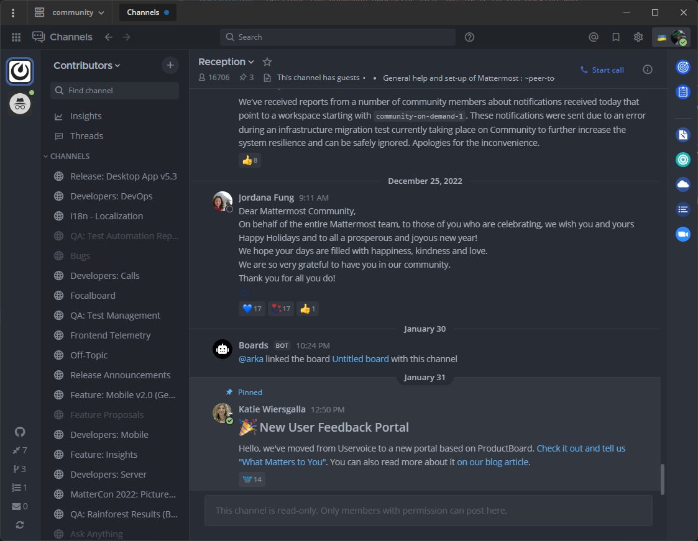

This is the primary view that encapsulates the core of the Desktop App interface. Most `BrowserView` objects are rendered using this window as their parent, and are affected by the behaviour of this window. Most other controls including the tray icon and taskbar/dock icon interact with this window, and most of their functionality is tied to it as well.

This window is managed by the `MainWindow` module located at [main/windows/mainWindow](https://github.com/mattermost/desktop/blob/master/src/main/windows/mainWindow.ts).

#### Screenshot:

#### Hooks:
- `init()`: Creates the `BrowserWindow` object for the Main Window, and adds all appropriate listeners.
- `get()`: Returns the `BrowserWindow` object for the Main Window. This is directly exposed as there are many different functions affecting the behaviour of the window and thus the encapsulating module often needs to pass that control to other modules. If `true` is passed as an argument, `init()` will be called if the window does not exist, otherwise `undefined` is returned.
- `getBounds()`: Returns the current size and location of the `BrowserWindow`, used for resize functionality, and to ensure that child windows/views are positioned correctly.
- `focusThreeDotMenu()`: Sends a message to the main window process that focuses the view and highlights and focuses the 3-dot menu on Windows/Linux. This is used when the `Alt` button is pressed as a shortcut to focus the menu.